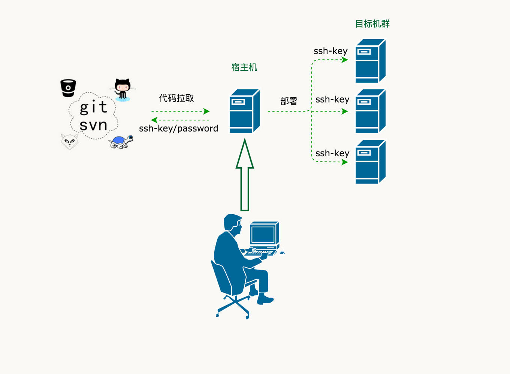

# 前言
本篇幅先介绍传统的代码发布系统的做法，引申出传统做法的不足，然后介绍 CodePub 的架构，优势和解决的问题.

# 传统的发布系统架构
传统的代码发布系统有很多, 典型的代表是 Jenkins、Walle(瓦力)等。当然了 Jenkins 不只是代码发布系统，同样也是持续集成、持续部署、自动化构建的系统。他们发布机制：核心都是 ssh 协议  

我们以最常用的 Walle 瓦力发布来举例说明它的实现原理：

整个代码发布系统由宿主机和目标机器组成。

1. 拉取代码到到宿主机服务器上
2. 对比发版前后的变化的文件
3. 把代码文件通过 ssh 协议推送到目标服务器上

正是由于它的这种架构，决定了很多问题是无法避免的，比如:  
1. 宿主机和目标机群需要维护 ssh-key，如果部署大量的机器和项目，ssh-key 的管理将会让人头疼
2. 推送代码到目标服务器和执行目标服务器脚本一般需要依赖软件，例如 rsync, Walle 用的是 Ansible，一个非常强大的运维自动化部署工具, 在部署和维护的过程中需要额外维护这些依赖软件
3. 如果多个部门共用代码发布系统，使用率很高，那么频繁的大量的本地拉取操作会导致宿主机服务器 I/O 延迟明显增大，导致宿主机反应过慢，影响系统稳定性
4. 即使很少量的文件变动，依然还是 拉取->对比->ssh推送，这个流程相对来说比较耗费时间
5. 非 Linux 系统是无法发布代码的，比如 Windows 是没有 ssh 的，只能依靠辅助软件来实现，增加部署维护成本

# CodePub架构
架构核心思想：去除中心、简化配置、使用简单、快速部署、高效发布

- 去除中心：去除了传统代码发布系统的宿主机的角色，不再支撑频繁的代码拉取和对比工作，只需要运行后台管理系统即可
- 简化配置：目标（节点）服务器不再需要配置任何的 ssh-key，只需要安装 agent 程序一键启动就 OK。agent 内部实现了git协议和 ssh 协议,git 操作不依赖系统的 git 命令, ssh 也不依赖系统的 ssh 命令和配置
- 快速部署：后台安装程序自动化，除 Mysql 数据库外，不需要依赖任何软件，一键安装和部署；节点安装下载一键启动
- 使用简单：后台管理设计合理，功能清晰，操作简单。
- 高效发布：利用 Go 内置协程并发发布多个节点；agent 节点程序内置实现了 ssh 协议，直接将代码从 git 库中拉取，提高代码发布效率

基于 `M(管理中心)/A(节点)` 的架构：

简单介绍一下发布流程：用户登录后台系统，添加并配置项目，点击发布，管理中心并发的发送指令给所有的需要发布代码的 agent 机器，agent 拿到指令信息解析并使用内置的 ssh 协议拉取代码。每个 agent 节点可以并发的拉取不同项目的代码。  

下面重点说一下 agent 操作的整个过程，首先指令里面发送的主要是要本次发布的: 任务id, branch\tag\commit_id、git 地址、git 账号密码、发布目录、前置命令、后置命令等信息。agent 收到指令后会：  

1. 创建发布任务。解析指令并获取发布的相关的信息，在 agent 内存中维护的发布任务队列中添加一个发布任务，**任务状态为未开始**。
2. 获取发布任务。agent 发布 worker 定时扫描发布队列里的任务，获取到新的发布任务，判断该任务需要执行的目录是否被正在发布的任务占用，如果被占用，不执行该任务；没有被占用，更新**任务状态为开始**，并开启一个协程发布操作。
3. 执行前置命令。如果本次发布的项目配置了前置命令，执行发布代码前置命令，如果执行方式是遇到错误停止，当前置命令执行失败，发布任务完成，更新发布**任务状态为执行完成，执行结果为失败**。
4. 执行代码发布：
    - 首先检查代码目录是否为空，如果为空，则 `clone` 仓库地址。如果不为空，则 `fetch` 仓库地址
    - 如果指令里有 `commit_id` 为空, 则说明是发布操作，根据指令中的 `branch` 或 `tag` 获取最后一次提交的 `commit_id`，如果指令里有 `commit_id`, 则说明是回滚操作
    - 使用获取到的 `commit_id` 在本地新建一个 auto 开头的分支
    - 强制 `checkout` 检出这个分支, 强制意味着所有的本地修改都会被清除
    - 删除本地其它分支，并返回发布成功后的 commit_id
    - 如果失败，更新发布**任务状态为执行完成，执行结果为失败**
5. 执行后置命令。如果本次发布的项目配置了后置命令，执行发布代码后置命令，如果执行方式是遇到错误停止，当后置命令执行失败，发布任务完成，更新发布**任务状态为执行完成，执行结果为失败**。
6. 执行成功。更新发布**任务状态为执行完成，执行结果为成功**。
7. 等待后台定时获取本次任务的发布状态，当管理后台获取成功后，会给 agent 发送获取状态成功确认删除该队列的指令。agent 从发布队列中删除该发布任务

>> 可以看到 agent 进行的是纯 git 操作，效率是很高的，对比 ssh 的推送代码的方式会比较高效。  
注意：agent 内部实现了 git 协议和 ssh 协议，git 操作不依赖系统的 git 命令，ssh 也不依赖系统的 ssh 命令 和配置。所以系统的 git 和 ssh 配置对 agent 没有任何影响和作用。
